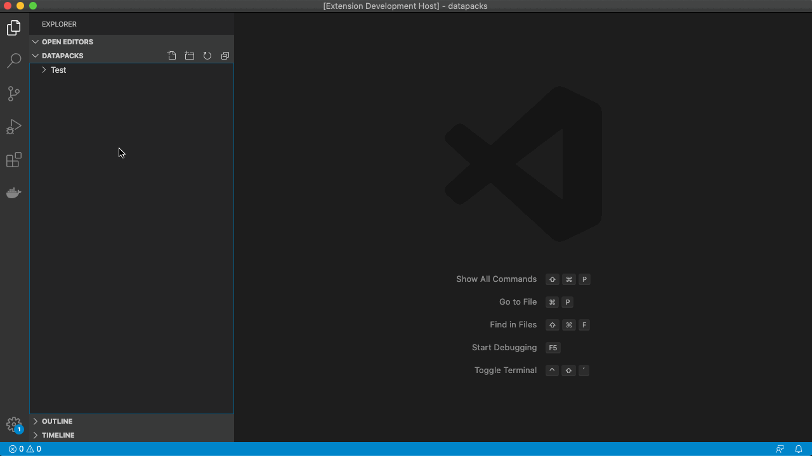
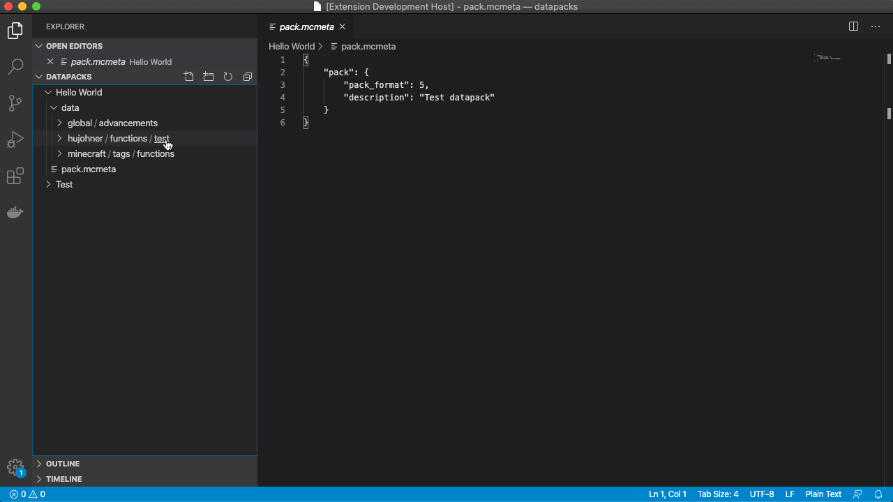

# mc-datapack
[Visual Studio Code](https://code.visualstudio.com) extenstion that allows you to quickly create Minecraft datapacks. 

Inspired by [this Rust application](https://github.com/oOBoomberOo/Nucleus).

## Features

1. New Datapack context command to create basic datapack structure:
```
.
├── data                                    // data folder
│   ├── <author>
│   │   └── functions
│   │       └── <namespace>                 // main and reset functions
│   │           ├── main.mcfunction
│   │           └── reset.mcfunction
│   └── minecraft
│   │   └── tags
│   │       └── functions                   // respective load and tick tags
│   │           ├── tick.json
│   │           └── load.json
│   └── global
│       └── advancements
│           ├── root.json                   // installed advancements
│           └── <namespace>.json            // datapack advancements
├── pack.mcmeta                             // required
```


2. New MCFunction file context command to create a function with file header.
Extension configuration to set default author username.


3. Recipe Editor context command on recipe documents to visually edit a recipe.


4. more to come...

Got suggestions? Feel free to create an issue [here](https://github.com/HuJohner/vscode-mc-datapack-ext/issues)!

## Requirements

There are no requirements or dependencies but I highly recommend using a MCFunctions language extension for syntax highlighting like [this](https://marketplace.visualstudio.com/items?itemName=arcensoth.language-mcfunction).

## Known Issues

Check the issues on Github [here](https://github.com/HuJohner/vscode-mc-datapack-ext/issues?q=is%3Aissue+is%3Aopen+sort%3Aupdated-desc+label%3Abug) Feel free to report any issues that you have.

## Acknowledgments

* [Minecraft base64 textures](https://github.com/destruc7i0n/minecraft-textures) by TheDestruc7i0n

## Release Notes

You can find the full changelog [here](https://github.com/HuJohner/vscode-mc-datapack-ext/blob/master/CHANGELOG.md).
